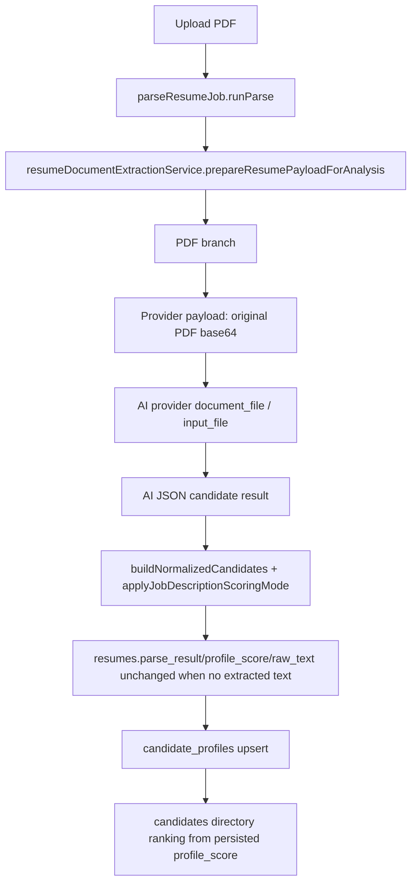
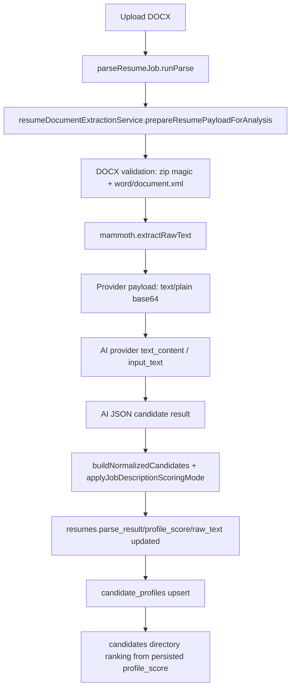
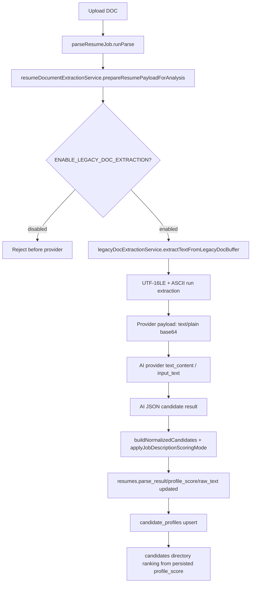

# P1 RCA: Resume format score variance diagnostic harness

## Scope and safety guardrails

This PR is intentionally diagnostic-only. It does not change production parsing, provider prompts, model selection, scoring, database schema, async queue behavior, ranking, rendering, or historical analyses.

The added harness uses synthetic resumes only and reports non-reversible fingerprints and aggregate quality metrics. It must not emit raw resume text, binary content, email addresses, phone numbers, or filenames containing personal data.

## Current end-to-end pipeline diagrams

### PDF upload



Evidence: the PDF path sets `inputKind: 'pdf_binary'`, `resumeInputMode: 'binary'`, and `extractionMethod: 'pdf_binary_provider_input'`; there is no local PDF text extraction or canonical fingerprint comparable to DOC/DOCX text in the current branch.

### DOCX upload



Evidence: DOCX extraction validates the Office zip structure, calls Mammoth raw-text extraction, rejects empty text, and prepares `text/plain` extracted text for AI analysis.

### Legacy DOC upload



Evidence: legacy DOC is feature-flagged; when enabled, it extracts text locally and sends text/plain to providers. When disabled, it fails before provider scoring.

## RCA question answers

1. **Exact payload reaching AI provider**
   - PDF: original file bytes as base64 with `application/pdf`; provider receives document-style input.
   - DOCX: Mammoth-extracted raw text is base64-encoded as `text/plain`; provider receives text-style input.
   - DOC: feature-flagged local extracted text is base64-encoded as `text/plain`; provider receives text-style input.

2. **Are PDFs sent as binary while Word files are sent as extracted text?**
   - Confirmed. The current diagnostic harness observes PDF `inputKind=pdf_binary` and Word `inputKind=extracted_text` for equivalent synthetic fixtures.

3. **Cleaning/normalization applied by format**
   - PDF: no local text extraction or cleaning before provider input.
   - DOCX: Mammoth raw text is trimmed, then the AI orchestration layer cleans extracted text for prompt use by removing NUL/replacement/zero-width characters, collapsing spaces, deduping lines, and filtering generic page/header labels.
   - DOC: UTF-16LE and ASCII text runs are normalized, deduped, and then the same AI prompt cleaning path is applied.
   - Fingerprints use NFKC normalization, lowercasing, whitespace normalization, and generic page/header filtering.

4. **Can format-specific extraction alter dates, skills, ordering, headings, or experience totals?**
   - Confirmed risk. PDF bypasses local extraction entirely, so provider-side PDF interpretation can differ from Word extracted text. Legacy DOC extraction is heuristic text-run extraction, which can lose punctuation or ordering depending on binary layout. DOCX Mammoth extraction generally preserves paragraph text but can flatten tables/layout.

5. **Does repeated scoring of exact same canonical text create different scores or labels?**
   - The harness now tests this deterministically with injected providers. Stable scripted provider responses produce zero score/label/ranking variance. Scripted nondeterministic responses are detected as scoring nondeterminism. Live-provider variance is intentionally not run in CI.

6. **Temperature, seed, model version, prompt version, schema behavior**
   - OpenAI requests set `temperature = 0` only when the model capability declares temperature support. No seed is passed. Model and prompt version are captured in diagnostic scoring runs. Schema normalization clamps/compacts provider output but does not make provider generation deterministic.

7. **Can retries or fallback providers overwrite valid results?**
   - Provider fallback is sequential within one analysis attempt and returns the first successful provider result. A failed primary can be followed by fallback success; the harness captures retry/fallback path metadata. There is no evidence in this PR that a later failed fallback overwrites an earlier success inside one `analyzeResumeWithConfiguredFallback` call.

8. **Can async processing or persistence races cause unpredictable winners?**
   - Suspected, not fixed here. `runParse` checks parent analysis activity before AI, after AI, and before persistence, then updates the resume row and candidate profile. There is no schema-level score idempotency key in this PR. The harness includes a pure idempotency diagnostic for duplicate completion events so a future integration test can identify winner changes without mutating production data.

9. **Does ranking use persisted result consistently?**
   - Confirmed for candidate directory ranking: directory sorting uses persisted `candidate_profiles.profile_score` when present and falls back to resume score when absent. The scoring source is included in diagnostic metadata for the API response.

10. **Are low-quality extractions silently passed into scoring?**
   - Confirmed risk for currently successful local text extraction paths. DOCX rejects empty extraction, legacy DOC rejects empty extraction, but there is no unified production quality gate for marker coverage, printable ratio, duplicate-line ratio, suspicious noise ratio, or PDF missing text in this PR.

## Confirmed causes

- **Format-specific provider input mismatch:** PDFs are binary provider inputs while DOCX/DOC are local extracted text inputs.
- **No unified PDF canonical text fingerprint:** current PDF path cannot be compared to Word extracted text before scoring.
- **No production extraction quality gate:** successful low-quality extractions can continue into scoring.
- **Provider nondeterminism remains possible:** temperature is not universally controlled, no seed is used, and live providers can change behavior by model/version.

## Suspected causes needing follow-up PRs

- Legacy DOC heuristic extraction may lose punctuation, section structure, tables, or dates for real-world documents.
- Provider-side PDF interpretation may omit text, reorder columns, or misread dates/headings.
- Concurrent/duplicate parse completions can still be last-writer-wins at the application level if the same resume is processed by multiple attempts/jobs.
- Ranking drift can follow persisted score drift because ranking consumes persisted profile score.

## Ruled out by inspection or diagnostic tests in this PR

- **UI rendering as root cause:** no rendering code changes are needed to explain score changes because persisted scores/ranks can differ upstream.
- **DOCX always binary:** DOCX is locally extracted and sent as text/plain in the inspected path.
- **Fallback overwrites success within one provider orchestration call:** current provider orchestration returns on first success.
- **Historical analyses are mutated by this PR:** no migrations, production jobs, or data updates are added.

## Diagnostic harness and fixtures

Added:

- `backend/src/services/resumeFormatDiagnosticHarness.js`
  - extraction diagnostics for PDF/DOCX/DOC fixtures;
  - safe text-quality metrics;
  - normalized fingerprint comparisons;
  - repeated canonical scoring diagnostics with injected provider adapters;
  - retry/fallback path capture;
  - pure async-persistence idempotency event diagnostic.
- `backend/src/services/resumeFormatDiagnosticFixtures.js`
  - synthetic equivalent PDF, DOCX, DOC fixtures;
  - missing-text PDF fixture;
  - low-quality DOC fixture.
- `backend/src/services/resumeFormatDiagnosticHarness.test.js`
  - regression coverage for equivalent formats, whitespace/header/footer normalization, missing-text PDF, low-quality extraction, repeated scoring, retry/fallback, and async idempotency diagnostics.

## Current diagnostic test results

Local command:

```bash
node --test backend/src/services/resumeFormatDiagnosticHarness.test.js
```

Observed result: 11 passing tests.

Key current-variance findings from the synthetic harness:

- Equivalent synthetic PDF is diagnosed as `pdf_binary` / `binary` and has no comparable extracted-text fingerprint.
- Equivalent synthetic DOCX is diagnosed as Mammoth extracted text.
- Equivalent synthetic DOC is diagnosed as legacy extracted text when `ENABLE_LEGACY_DOC_EXTRACTION=true`.
- DOCX and DOC fingerprints can match when local extraction produces the same canonical text.
- PDF remains non-comparable until a unified PDF text extraction path exists.
- Repeated exact canonical text scoring can be detected as stable or nondeterministic without calling live providers.

## Recommended phased remediation plan (separate PRs)

1. **Unified PDF canonical extraction and quality gate**
   - Add local PDF text extraction for selectable-text PDFs.
   - Add OCR only behind a feature flag if needed.
   - Compute quality metrics and normalized fingerprint before provider scoring.
   - Reject/retry/route low-quality extraction instead of silently scoring it.

2. **Stronger legacy DOC extraction**
   - Replace or augment heuristic text-run extraction with a more reliable converter/service.
   - Keep the existing feature flag and diagnostics.
   - Add real-world synthetic layout fixtures for tables, columns, bullets, and date ranges.

3. **Structured profile contract**
   - Introduce a stable intermediate candidate-profile schema generated from canonical text before JD scoring.
   - Compare profile fields across formats before scoring.

4. **Deterministic scoring engine**
   - Version prompt, model, schema, and scoring rubric together.
   - Use deterministic local scoring where possible; if LLM scoring remains, capture model snapshot and deterministic controls.

5. **Idempotency and score caching**
   - Cache score by `(JD fingerprint, resume canonical fingerprint, scoring engine version)`.
   - Make parse completion idempotent so duplicate attempts cannot overwrite a valid completed score unpredictably.

6. **Feature-flag rollout and monitoring**
   - Roll out format-equivalence diagnostics in observe-only mode.
   - Add dashboards/alerts for extraction quality, fingerprint mismatch, provider fallback rate, score variance, and ranking churn.

## Remaining risks

- CI uses synthetic fixtures and injected providers; it does not prove live-provider determinism.
- The PDF fixture is intentionally not parsed locally because this PR does not implement the production PDF fix.
- Legacy DOC tests exercise representative text-run buffers, not every real OLE Word variant.
- Async idempotency is a pure diagnostic in this PR; database-level idempotency is deferred.

## Rollback notes

Rollback is safe: remove the diagnostic harness, synthetic fixtures, tests, and this RCA document. No schema, UI, production scoring, queue, ranking, or historical data changes are included.
